<p align = "center">

</p>

# PDB2MC: Bridging Biomolecules and Minecraft for accessible, interactive 3D visualization.
### Author: Markus Nevil, PhD<br>Version: 1.0.2</sup>


**Table of Contents**
 - [Introduction](#introduction)
 - [Installation](#installation)
   - [Issues and Questions](#issues-and-questions)
 - [General Program Procedure](#general-program-procedure)
 - [Preparing a Minecraft world](#preparing-a-new-minecraft-world-for-pdb-models)
 - [Walkthrough of an example GFP model](#walkthrough-of-an-example-gfp-model)
   - [(Optional) Download a PDB file from RCSB PDB](#optional-download-a-pdb-file-from-rcsb-pdb)
   - [Open the PDB2MC program](#open-the-pdb2mc-program)
   - [Open the Minecraft world](#open-the-minecraft-world)
 - [Description of Program modes](#description-of-program-modes)
 - [Description of options](#description-of-options)
   - [Default atom colors](#default-atom-colors)
 - [Glossary of terms](#glossary-of-terms)
 - [Program Flowchart](#generalized-flowchart-of-program-procedure)
 - [Acknowledgements](#acknowledgements)
 - [Citation](#citation)
 - [License](#license)

## Introduction
The structures of proteins and other biomolecules determined by X-ray crystallography, NMR, and cryo-EM are published at
the RCSB Protein Data Bank (rcsb.org). These structures are primarily viewed using free or paid programs that are
powerful tools, yet whose learning curve may pose an inaccessible barrier to for educators, students, and the public.
The purpose of the stand-alone `PDB2MC` program is to make a fun and accessible alternative by generating files that 
can be loaded by the popular video game Minecraft.

<p align = "center">

</p>

The `PDB2MC` program comes with several models, but also can use any PDB file downloaded from RCSB Protein Data Bank. 
Currently, the program only includes a .EXE file for Windows, but can be installed on any operating system with Python 3.11+

This guide includes a quick start, glossary of terms, description of features, and a walk through to generate a model of the included GFP model.

## Installation:

### Windows .EXE installation
1. Download the latest release of the program from Github via a Zip file.
2. Extract the contents of the Zip file to a location of your choice (e.g. Desktop).
3. Open the program by double-clicking the `PDB2MC.exe` file.

### Python installation
1. Download the latest version with `Code` > `Download ZIP` from Github.
2. Extract the contents of the Zip file to a location of your choice (e.g. Desktop).
3. Open a terminal and navidgate to the extracted folder.
4. Install PDB2MC with `pip install .`
5. Run PDB2MC with `python -m PDB2MC`

> [!IMPORTANT]
> Due to the size of even small models, it is recommended to prepare a special Minecraft world with minimal other blocks to generate models.
> This will ensure that there is the maximum amount of space to generate models.

### Issues and Questions
Please note any bugs and/or relay any questions under the Issues tab: 
https://github.com/markus-nevil/mcpdb/issues.

## General Program Procedure

1. Ensure that you have a Minecraft world prepared for PDB models.
   - Creative mode, superflat world with a white floor is recommended.

2. Download a model in a .pdb format
   - The program comes with several example models, but many models from the RCSB PDB website are compatible.
   - The program has a button that will open the RCSB PDB website for ease of access.

3. Open the PDB2MC program
   - Select the mode.
   - Select the Minecraft save file and PDB file.
   - Select the options you wish to change.
   - Press `Create Minecraft Functions` to generate the model.
     - This may take a few minutes depending on the complexity of the model and settings.

4. Open the Minecraft world
   - Open the Minecraft world and open the console with `t`.
   - Type `/reload` to reload the world and ensure that the functions are recognized.
   - Type `/function protein:build_` and select your model.
     - This will generate the model relative to the player's position.
   - Type `/clear protien:clear_` and select your model to remove it.
     - It is essential to stand on the black `obsidian` block that was generated when the model was created.


## Preparing a new Minecraft world for PDB models
1. Open Minecraft (without any mods) and follow these steps to prepare a `Superflat Creative` world
    1. Select `Single Player`
    2. Select `Create New World`

2. On the `Game` tab, change the following:
    1. Change the `World Name` to something you will recognize.
    2. `Game Mode: Creative`
    3. `Difficulty: Peaceful`'
    4. `Allow Cheats: ON`

    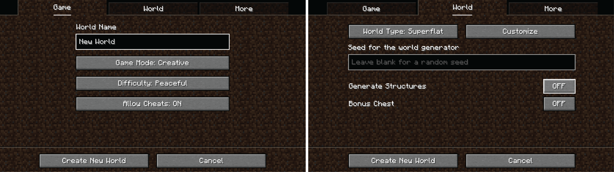

4. On the 'World' tab, change the following:
    1. `World Type: Superflat`
    2. `Generate Structures: OFF`
    3. Select `Customize`, then `Presets` to create a world with a white floor (not required,but suggsted).
   
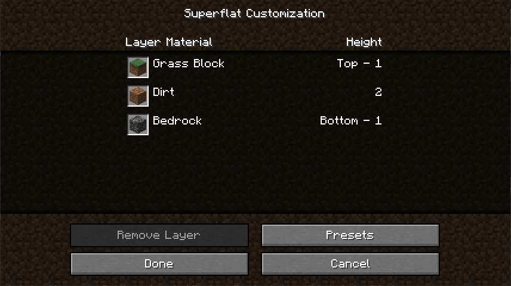

5. Change the text of the top box to: `minecraft:bedrock,minecraft:white_concrete`

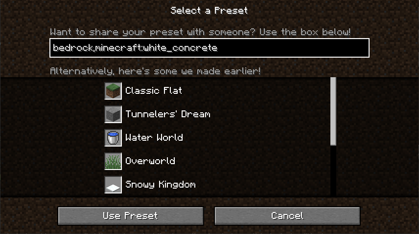

6. On the `More` tab, select `Game Rules` to change the following:

    1. `Spawn phantoms OFF`
    2. `Command Chain Size Limit: 1000000 (or higher)`
    3. `Spawn mobs OFF`
    4. `Spawn pillager patrols OFF`
    5. `Spawn Wandering Traders OFF`
    6. `Spawn Wardens OFF`
    7. `Advance time of day OFF`
    8. `Update weather OFF`

    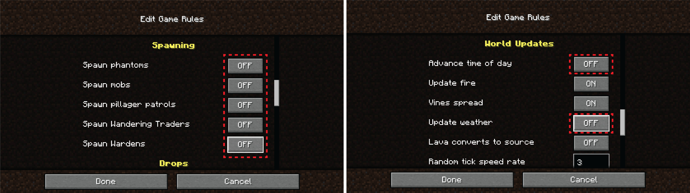

7. When finished select `Done` and/or `Create New World` to create the world.
    1. Minecraft can be closed until the PDB model is generated, or kept open.

## Walkthrough of an example GFP model

### (Optional) Download a PDB file from RCSB PDB

> [!NOTE]
> `PDB2MC` comes pre-loaded with several example models and models of the individual
> amino acids. The following is an example of how to download a PDB file from RCSB PDB.

1. Navigate to [https://rcsb.org](https://www.rcsb.org/)
   - For ease, there is an 'RCSB PDB' button in the program that will open this website. 
   - This is the home page for the RCSB PDB website. It contains a search bar and links to other resources.
2. In the Search bar, search for a biomolecule (For this example: "Green fluorescent protein")

    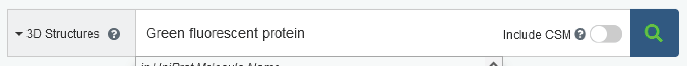

3. Select a structure (For this example: the model named "1GFL")
    - This is the entry for published structures. It contains 3D previews, sequences, and structure information as well as the original citation.

   
   
4. Select `Download Files` and download the `PDB Format` file. 
   - Take note where this file is saved.
   
   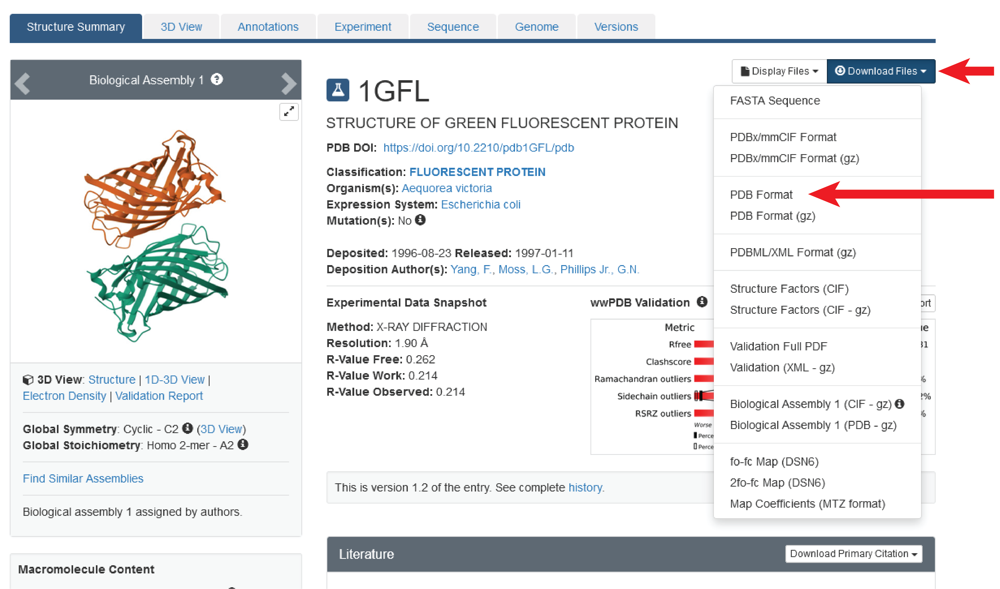

### Open the PDB2MC program
- Select the desired mode
  - For this example, select `Ribbon` from the `Select Mode:` dropdown menu

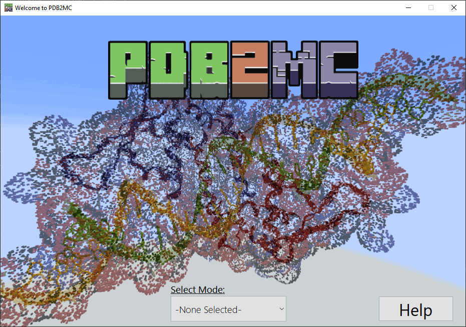

> [!NOTE]
> Descriptions of the different modes are included in the next section.

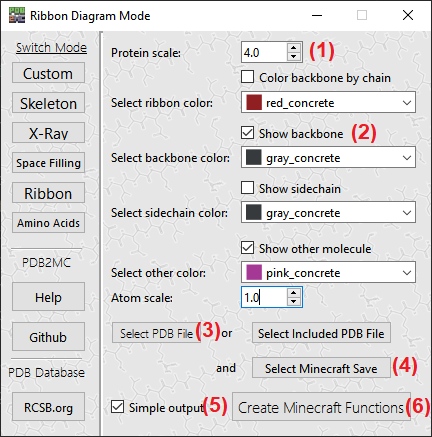

1. Change `Protein scale` to 4.0.
    - A future step will suggest a maximum size for this scale.
2. Ensure that `Show Backbone` is checked
3. Press `Select PDB` and choose the downloaded PDB file from your Downloads folder.
    - **Note:** Select any ".pdb" file and press `Ok`, no other file type is accepted.
    - *Alternative step:* Press `Select Included PDB` to select the included GFP model
4. Press `Select Minecraft Save` and choose the Minecraft world
    - **Note:** Double-click the name of the world and press `Ok`, no other folder is accepted.
    - A dialog box will appear with a suggested scaling factor for `Protein scale`.
5. Ensure that `Simple output` is checked.
   - This will create single "build" and "clear" functions. Unselected, functions for individual parts of the model will be created.
6. Press `Create Minecraft Functions` and wait for the confirmation dialog box.
    - This indicates that the program has finished creating Minecraft functions that will generate the model.
    - The program *does not* have to be closed in case changes need to be made and the Minecraft model regenerated.

> [!NOTE]
> These steps may be taken in any order, and incompatible options will be ignored.
> Details on the options are described in the next section.

### Open the Minecraft world
1. If not already open, start Minecraft and open the world intended to generate the model
2. Open the Minecraft console by pressing `t` on your keyboard
3. Type `/reload` to reload the Minecraft world and guarentee that the functions are recognized by the game
4. Move to a desired location in the world.
    - The model will be generated *relative to the player* and best results for most models will be created while the player is on the ground.
    2. The Minecraft command `/tp @e ~ ~ ~1000` will send the player 1,000 blocks away from the current location. This is useful to separate multiple models
5. **To generate the model:**
    - Type `/function protein:build_` which will bring up the main command, press `tab` to autocomplete for your model.
       * **Note:** Each model is generated with its unique PDB number. For the GFP example, it would be "1GFL"
    - Press `Enter` to start the generation.
> [!TIP]
> Individual parts of the model can be separately generated by de-selecting `Simple output` and individually using the other functions: 
> `backbone`, `atoms`, `heteroatoms`, `ribbon`, etc.
> 
> In rare circumstances, due to limitations within Minecraft it may be neccessary to call these individual functions if the `build_` function 
> does not create the full model
> 
> Any time a function is run to add a component to the same model, stand on the black obsidian block (generated after 
> the first command) to ensure the model components are placed correctly.

6. **To clear the model:**
    - Find the black `obsidian` block that was generated when the model was created, this represents where the model was generated.
    - Type `/function protein:clear_` which will bring up the clearing command, press `tab` to autocomplete for your model.
    - Press `Enter` to remove the model.

> [!NOTE]
> Running the clear command anywhere except the obsidian block generated for that model will not remove the model.
> The program works by making `and` deleting models relative to the players current position.

## Description of Program modes

1. Custom
: This mode allows for the most customization of the visualization of atoms and bonds. Useful if you want to add, remove,
or modify most elements of the model.
<p align = "center">
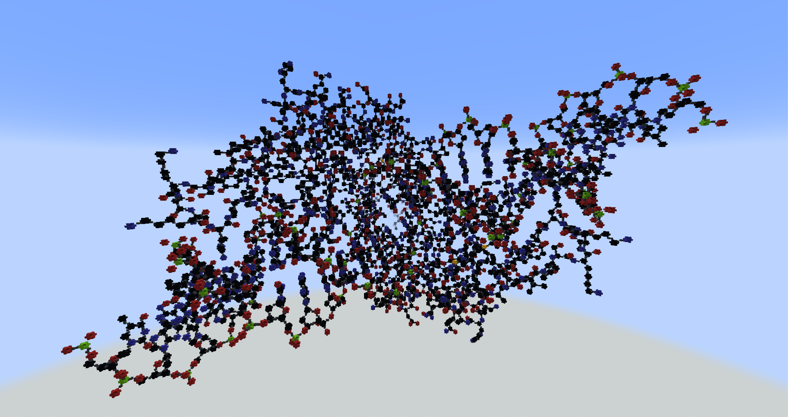
</p>

2. Skeleton
: Makes a simple model of the protein backbone and sidechains. These represent the bond between atoms, without showing the atoms themselves. Useful for visualizing the overall shape of the protein with or without 
amino acid side chains.
<p align = "center">
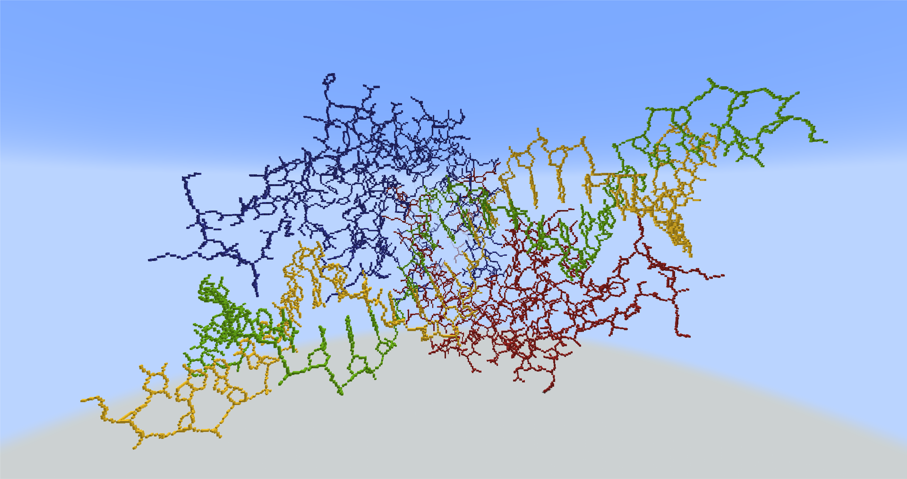
</p>


3. X-ray
: Preset that creates a model that displays both atoms and bond of the PDB file. However, the default setting for the
visualization of the atoms are set to glass blocks and the bonds are set to opaque blocks, which allows for the visualization of the bonds between atoms.
<p align = "center">
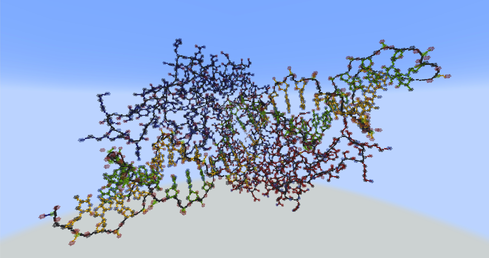
</p>


4. Space Filling 
: This mode creates a model where the atoms are represented by the approximate "Solvent-Accessible Surface Area". This 
is roughly the shape of the cloud of electrons that surrounds each atom which prevents "solvents" like water from entering
the interior of large bio-molecules. This gives the general appearance of what a protein would look like if
it were scaled up. Inside the protein, the bonds are created as a `skeleton` model, thus exploration of the interior is useful
for understanding the connection between overall shape and the bonds between atoms.
<p align = "center">
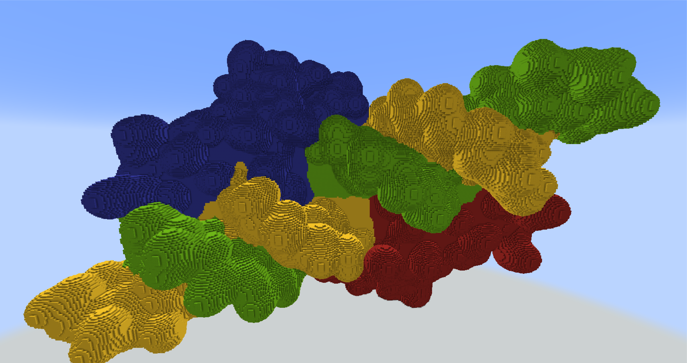
</p>


> [!WARNING]
> Space Filling mode will take a long time for `PDB2MC` to run and may take Minecraft a long
time to process.

5. Amino Acid 
: This mode creates a model where the amino acids are represented by a single sphere. This is no longer a true representation
however, it is useful for visualizing the overall shape of the protein and the location/identity of the amino acids.
<p align = "center">
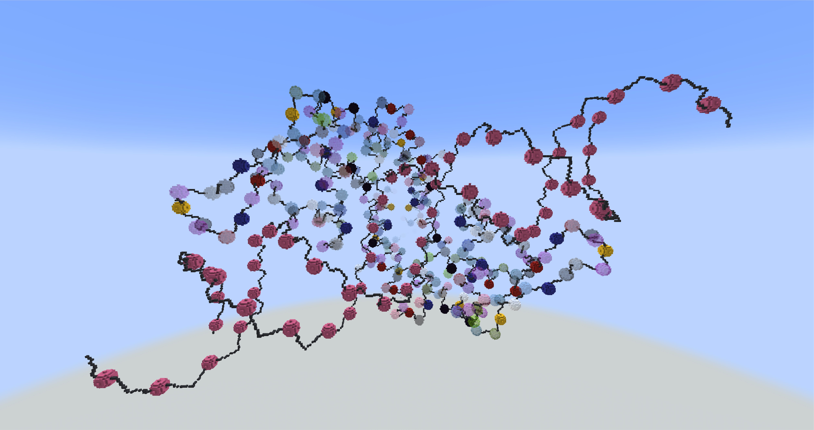
</p>


6. Ribbon
: This is preset creates a cartoon-like representation of the protein. The backbone is presented as a smoothed line. Residues
that are part of either an alpha-helix or beta-sheet are represented as ribbons. The ribbons are colored based on the peptide
or DNA/RNA chain to which they belong. This mode is useful for visualizing the secondary and tertiary structure of the protein.
<p align = "center">
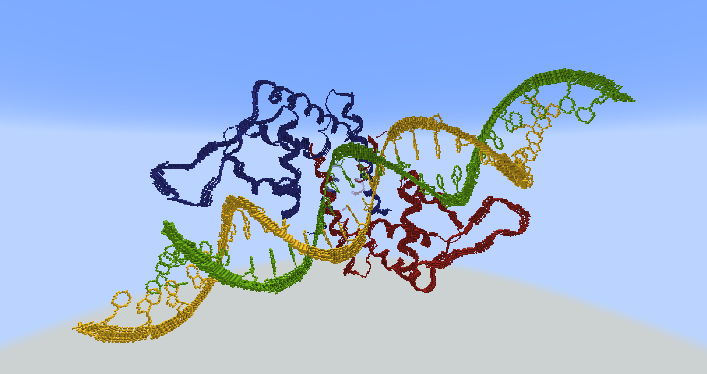
</p>


## Description of options

1. Features common to most-or-all modes

   - `Scale determination: `Once a PDB file is loaded, the program will determine the size of the model and suggest a
   maximum scale for the model. This is to prevent the model from being too large for Minecraft's limited up-and-down (Y) axis.
   In the current version, this appears as a pop-up.
   - `Rotation of model: `Once the user starts generating the model, the model will rotate such that the shortest dimension
   will become the up-and-down (Y) axis. This is to prevent the model from being too large for Minecraft.
   - `Removal of Hydrogen and Water: `Due to the nature of X-ray crystallography, hydrogen atoms are often not captured
   in the PDB file. Additionally, water molecules are often present in the crystal and are not part of the protein. If present
   these atoms are removed from the visualization.
   - `Removal of ambiguous residues: `Some PDB files contain amino acids that are not fully resolved. This means that the
   exact orientation of amino acid residues are not known. The ambiguous residues are removed from the visualization.
   - `Color of chains: `In modes that color the backbone of the protein by default or optionally, the chains will be colored
   based on a preset set of brightly colored blocks. This may be made customizable in the future versions.
   - `Minecraft datapack: `When a new Minecraft world first has model functions generated, a "datapack" is required. 
   The program will automatically generate the datapack file structure and place the required pack.mcmeta file in the datapack.
   

2. `Atom Scale`
: This option allows the user to change the size of the atoms by applying a scaling factor to the radius of the spheres 
that will represent those atoms.

3. `Protein Scale`
: This option allows the user to change the size of the protein by applying a scaling factor to the distance between
each atoms. Thus, the protein will be scaled up or down. This option is useful for visualizing the bonds between each atom
since `Atom Scale` will not change the distance between atoms and is a separate option. 

4. `Select _____ color`
: These sets of options allow the user to individually select the Minecraft block that will represent a particular atom,
group of atoms, or bond. The user may select a block from a curated list from the current version of
Minecraft. "Other color" refers to atoms which are uncommon to PDB models.

5. `Color backbone by chain`
: If selected, the backbone or backbone and sidechain will be colored by the "chain" number. Single protein, DNA, or DNA
molecules are considered chains. this option is useful to view the different subunits that make up a full complex or model.

6. `Backbone _____`
: References to a protein backbone refer to the atoms that make up the long chain of amino acids. The backbone are the
N-C-C atoms of each amino acid residue. Several options exist to modify the appearance of these atoms and their bonds.

7. `Sidechain _____`
: References to a protein sidechain refer to the atoms that make up the variable R group of each amino acid. Several options
exist to modify the appearance of these atoms and their bonds. 
 
8. `Show other molecules`
: This option allows the user to visualize the atoms and bonds of other molecules that are present in the PDB file. These 
are often ligands, co-factors, or substrates that are bound to the protein. These are not part of the protein and are always 
displayed as a "ball-and-stick" model.

9. `Use "mesh-style" atoms`
: Selecting this option will reduce the number of blocks to display a "cloud" of blocks rather than a full sphere for each atom.
This is another method to visualize the interior and bond structures of models without being occluded by the atoms.

10. `Help` button
: Pressing this button will open a new window with a link to this guide.

11. `Github` button
: Pressing this button will open a new window with a link to the Github repository for this program.

12. `RCSB.org` button
: Pressing this button will open a new window with a link to the RCSB PDB website. This is where you can look up and download
PDB files for your own models.

<a id="default-atom-colors"></a>
13. Default atom colors
: Below is a table of the default colors for each atom. These are the colors that will be used if the user does not select
alternatives.

| Abbreviation | Atom | Color                                                                  | Currently modifiable?                                 |
  | ---- | ---- |------------------------------------------------------------------------|-------------------------------------------------------|
  | C | Carbon |  Black           |  Yes |
  | O | Oxygen |  Red               |  Yes |
  | N | Nitrogen |  Blue             |  Yes |
  | S | Sulfur |  Yellow         |  Yes |
  | P | Phosphorous |  Green            |  Yes |
| H | Hydrogen |  White           |  No   |
| Fe | Iron |  Iron block |  No   |
  | - | Other |  Pink             |  Yes |


## Glossary of terms

1. X-ray Crystallography
: A method of determining the structure of a molecule by shooting X-rays at a crystal of the molecule. The x-rays are
deflected by the electrons surrounding the atoms of the molecule. By measuring this "diffraction" pattern, the structure
of the molecule can be determined.

2. PDB
: The Protein Data Bank (PDB) file is a database of coordinates and other information that describes the structure of a 
molecule or other biomolecule. The PDB file contains a lot of useful information but is often not human-readable and
 requires another program to visualize the structure.

3. Protein/Enzyme
: A protein is the biomolecule that makes up the structural and functional machines of all cells. Protein is a more general
term for any of these molecules made from amino acids and encoded by the DNA of the organism. Enyzmes are proteins that
 have a specific function, such as catalyzing a reaction to make a product.

4. Primary, Secondary, Tertiary, Quarternary structures
: Proteins can be described in terms of their structure. The primary structure is the first level of structure and is the
 amino acid sequence of the protein. Secondary structure are the local structures within stretches of amino acids in a 
protein such as alpha helices and beta sheets. Tertiary structure is the overall structure of the protein and is the primary
structure folded into a 3D shape. Quaternary structure describes when multiple proteins come together to form a larger complex
 potentially with more or a different function than the individual proteins.

5. Amino Acid
: Amino acids are the building blocks of proteins. Each individual amino acid "residue" has backbone atoms: An amino (N) group,
 a carboxyl (C=O) group, and a center carbon atom. The center carbon has a variable "R" group which may be as small as a single
 hydrogen atom or as large as a carbon ring structure. The R group determines the properties of the amino acid.

6. Backbone and Sidechain
: These terms refer to the parts of an amino acid. The backbone is the amino and carboxyl groups and the center carbon, 
thus when visualized, appears to be a long string that snakes through the protein. The sidechain is the variable R group.
that gives each individual amino acid its unique properties. In certain models, these are visualized as shapes that protrude
from the backbone.

7. Ligand, Co-factor, Substrate
: These terms refer to small-to-medium sized molecules that interact with proteins. A ligand is a molecule that binds to a protein
 and may change the function of the protein. A co-factor is a molecule that is required for the protein to function. A substrate
 is a molecule that is acted upon by the protein which may be changed into a product.

8. DNA and RNA
: These molecules represent the beginning and middle stage of the central dogma: DNA is the molecule that makes up the 
genome, where genetic information is stored and inherited. RNA is the short-lived messenger molecule that is transcribed 
from the DNA. Some RNA molecules are translated into proteins, but others may have other functions. DNA and RNA differ 
in structure as well as function: RNA has an extra hydroxyl group on its ribose sugar and is single-stranded, while DNA 
lacks this hydroxyl and is often double-stranded.

9. Heteroatom and Atom
: These terms are used to describe the atoms that make up the molecules in the PDB file. Both are atoms and most often
Carbon, Oxygen, Nitogen, Phosphorous, and Sulfur, however some heteroatoms are metals or other elements. In the PDB file,
the Protein, DNA, and/or RNA atoms are denoted as "atoms", while the atoms that make up ligands, co-factors, and substrates are denoted as
"heteroatoms"

10. Bond
: A bond is the connection between two atoms and within the structure created by the PDB file. This represents the sharing
of electrons between two atoms (in "covalent bonds"). Hydrogen and ionic bonds are not represented in the PDB file.

## Generalized Flowchart of Program Procedure

A generalized flowchart of the program procedure is shown below. This is a simplified version of the actual program procedure
and will vary depending on the mode and options selected.

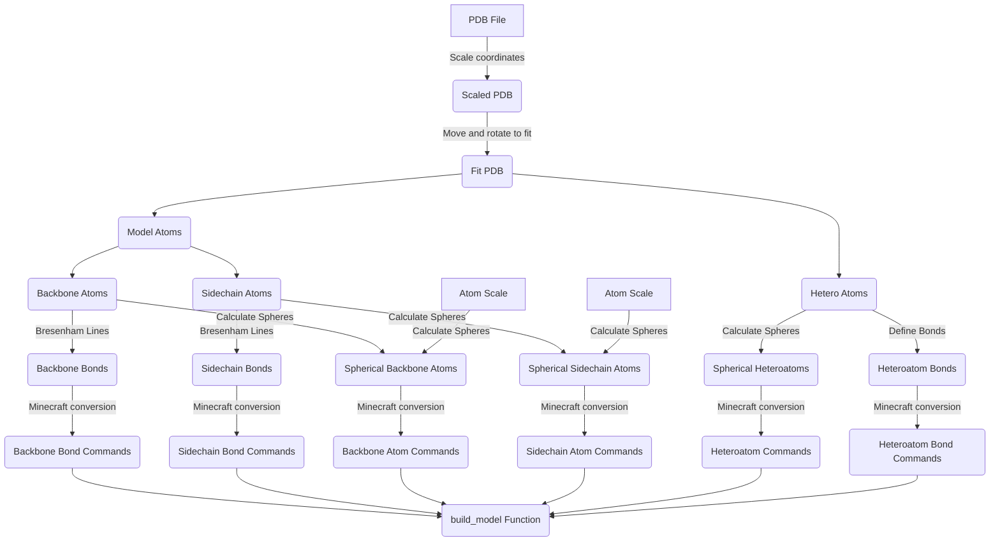
## Acknowledgements
Thanks to Max Canoodt (@mcndt) for the Minecraft block color data.

## Citation
*PDB2MC is not yet published with an associated paper, however if you use PDB2MC in your research, please cite the following:* <br>

Nevil, M. 2024. [**PDB2MC: Bridging Biomolecules and Minecraft for accessible, interactive 3D visualization.**](https://github.com/markus-nevil/mcpdb).

```
@article{NevilMarkus2024,
author = {Nevil, M.},
title = {PDB2MC: Bridging Biomolecules and Minecraft for accessible, interactive 3D visualization.},
year = {2024},
}
```

## License

MIT License

Copyright (c) 2024 Markus Nevil

Permission is hereby granted, free of charge, to any person obtaining a copy
of this software and associated documentation files (the "Software"), to deal
in the Software without restriction, including without limitation the rights
to use, copy, modify, merge, publish, distribute, sublicense, and/or sell
copies of the Software, and to permit persons to whom the Software is
furnished to do so, subject to the following conditions:

The above copyright notice and this permission notice shall be included in all
copies or substantial portions of the Software.

THE SOFTWARE IS PROVIDED "AS IS", WITHOUT WARRANTY OF ANY KIND, EXPRESS OR
IMPLIED, INCLUDING BUT NOT LIMITED TO THE WARRANTIES OF MERCHANTABILITY,
FITNESS FOR A PARTICULAR PURPOSE AND NONINFRINGEMENT. IN NO EVENT SHALL THE
AUTHORS OR COPYRIGHT HOLDERS BE LIABLE FOR ANY CLAIM, DAMAGES OR OTHER
LIABILITY, WHETHER IN AN ACTION OF CONTRACT, TORT OR OTHERWISE, ARISING FROM,
OUT OF OR IN CONNECTION WITH THE SOFTWARE OR THE USE OR OTHER DEALINGS IN THE
SOFTWARE.